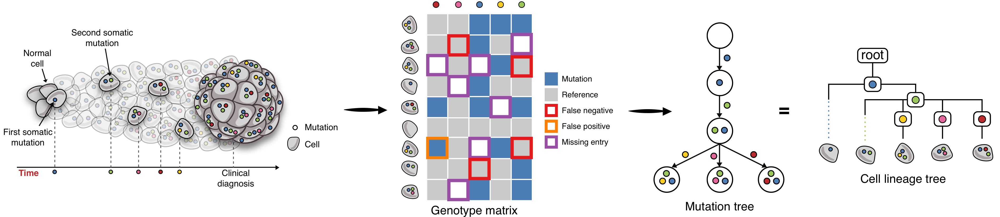
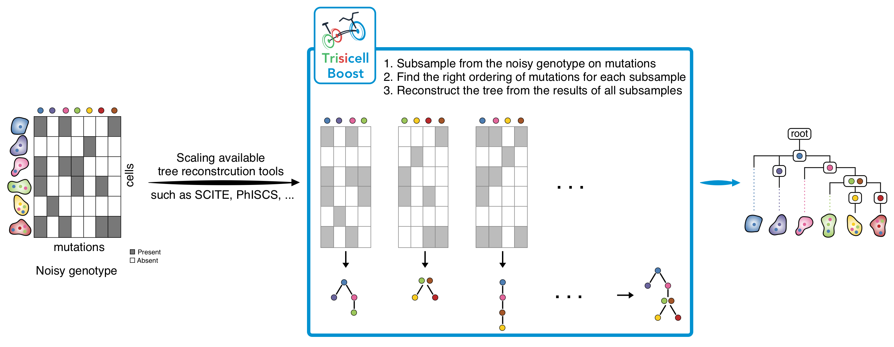
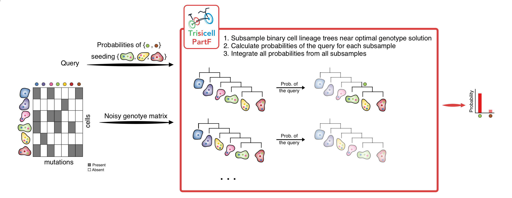
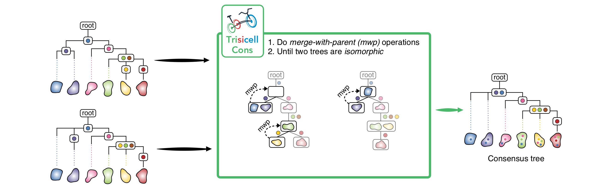

:tocdepth: 1

About Trisicell
---------------
Trisicell is a computational toolkit for scalable intratumor heterogeneity
inference and validation from full-length transcriptome profiling of
single-cell data (e.g. Smart-seq2) as well as single cell genome or exome
sequencing data. Trisicell allows identifying and validating robust portions
of a tumor progression tree, offering the ability to focus on the most important
(sub)clones and the genomic alterations that seed the associated clonal
expansion.

Tumor Progression Tree Reconstruction Models
~~~~~~~~~~~~~~~~~~~~~~~~~~~~~~~~~~~~~~~~~~~~
Cancer is an evolutionary process. Looking back in time there were somatic
mutational events that resulted in an emergence of the first cancerous cell.
By the means of cell division, the number of cancerous cells grew, and newly
born cells acquired additional mutations over time, which results in distinct
populations of cells, each with its own complement of somatic mutations.
Consequently, tumors are typically heterogeneous and are made of these different
populations of cells. The heterogeneity provides the fuel for resistance either
to the therapy or to the immune system. Single-cell sequencing (SCS) provides
high resolution data that enables studying tumor progression tree and heterogeneity
at unprecedented detail.

After mutation calling in every cell obtained by SCS, we have a matrix where
rows represent individual cells and columns represent somatic mutations. The
entries of the matrix show the presence/absence of mutations in cells. This
matrix is better known as the genotype matrix. There are several types of noise
present in the observed single-cell genotype matrix and they include:

* False-negative errors
    where a mutation is actually present in the cell but due to allele dropout
    (either biological or technical) or variance in sequencing coverage, in the
    genotype matrix it is reported as absent in the cell
* False-positive errors
    where a mutation is absent in the cell but in the genotype matrix it is reported
    to be present
* Missing entries
    where some entries contain no information about mutation presence or absence.
    Their presence in the matrix is usually due to insufficient coverage or lack of
    expression at the mutated loci in the cell

Due to the presence of false positive and false negative mutation calls, in
most cases, the observed matrix contains a triplet of cells and a pair of
columns such that in one of the three cells both mutations are reported to be
present, in one of them it is reported that only the first mutation is present
and in the remaining cell it is reported that only the second mutation is
present. We say that such a triplet of cells and a pair of mutations form a
*conflict*. These conflicts prevents us from reconstructing the tree of tumor
progression directly from the observed matrix and requires the development of
automated computational methods for finding the trees that best match the
observed data.

There are several techniques and methods to remove the noise/conflicts from
the input genotype matrix. They are mostly based on Integer Linear Programming
(ILP), Constraint Satisfaction Programming (CSP), Markov chain Monte Carlo (MCMC)
sampling and Neighbor Joining (NJ). For more details, we highly recommend to
read our `Trisicell <https://doi.org/10.1101/2021.03.26.437185>`_ and
`review <https://doi.org/10.1089/cmb.2020.0595>`_ papers about building
tumor progression tree by exploring the space of binary matrices.

Trisicell Components
~~~~~~~~~~~~~~~~~~~~

Trisicell is comprised of three computational methods of independent but complementary
aims and applications:

1) Trisicell-Boost:
*******************

Trisicell-Boost is a booster for phylogeny inference methods allowing them to scale up
and handle large and noisy scRNAseq datasets.

2) Trisicell-PartF:
*******************

Trisicell-PartF employs a localized sampling strategy to compute the probability of any
user-specified set of cells forming a subclone seeded by one or more
(again user- specified) mutations.

3) Trisicell-Cons:
******************

Trisicell-Cons is devised to compare two or more phylogenies (more specifically
cell-lineage trees) derived from the same single-cell data, and build their consensus
tree by “collapsing” the minimum number of their edges so that the resulting trees are
isomorphic

